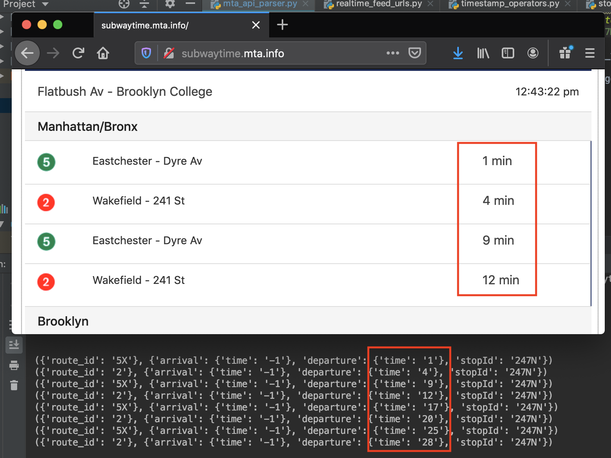

# :tv::metro: MTA COUNTDOWN CLOCK REPLICA :metro::tv:

Repository that pulls in real time data feeds from the Metropolitan Transportation Authority based in New York City.
The goal of this repo serves as a _'Hello World'_ into the realm of electronics to which I shall replicate a real-time
countdown clock normally found in MTA subway stations. This shall be accomplished by mapping the std_out stream of this
application along with relevant static content (i.e. portable pixel format image and train text) to display on LED matrix controlled by a Raspberry Pi.

## API Validation

## REQUIREMENTS
This application assumes [pip3](https://pypi.org/project/pip/) and [python3](https://www.python.org/downloads/) (at least version 3.7)
are installed on your machine

## WIRING
General wiring instructions can be found [here](https://github.com/KesMath/MTA-Countdown-Clock-Replica/blob/master/pdf/connecting-a-16x32-rgb-led-matrix-panel-to-a-raspberry-pi.pdf).
For GPIO to HUB75 interface connection, assure you fetch the corresponding GPIO pin layout 
for your particular Raspberry Pi model. View the schematics listing [here](https://www.raspberrypi.org/documentation/hardware/raspberrypi/schematics/README.md)
to search accordingly.

## TO BE CONTINUED...
Development shall recommence after hardware troubleshooting is completed